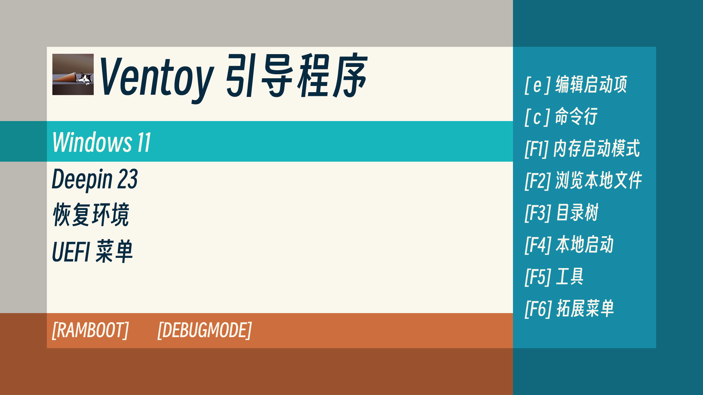

# 

## 568flat

568flat is a cool grub 2 theme which is designed for ventoy.

> [568flat](#568flat-installation) is designed for resolution of 1024x544 and above.
>
> If your screen resolution is over 2048x1088, please use [568flat_x2](#568flat_x2-installation) for better experience.

## Installation

If the resolution is not over 2048x1088, please goto [568flat Installation](#568flat-installation); Else, goto [568flat_x2 Installation](#568flat_x2-installation).

### 568flat Installation

Copy the `568flat` folder into `ventoy/themes` which should be located in the partition where your ISOs are located.

Make sure that `ventoy/ventoy.json` contains:

```json
{
    "theme":{
        "file": "/ventoy/themes/568flat/theme.txt",
        "fonts":[
            "/ventoy/themes/568flat/SmileySans-Oblique_48.pf2",
            "/ventoy/themes/568flat/SmileySans-Oblique_32.pf2"
        ]
    }
}
```

### 568flat_x2 Installation

Copy the `568flat_x2` folder into `ventoy/themes` which should be located in the partition where your ISOs are located.

Make sure that `ventoy/ventoy.json` contains:

```json
{
    "theme":{
        "file": "/ventoy/themes/568flat_x2/theme.txt",
        "fonts":[
            "/ventoy/themes/568flat_x2/SmileySans-Oblique_96.pf2",
            "/ventoy/themes/568flat_x2/SmileySans-Oblique_64.pf2"
        ]
    }
}
```

---

[About Smiley Sans](https://github.com/atelier-anchor/smiley-sans)

[More info about ventoy themes](https://www.ventoy.net/en/plugin_theme.html)
