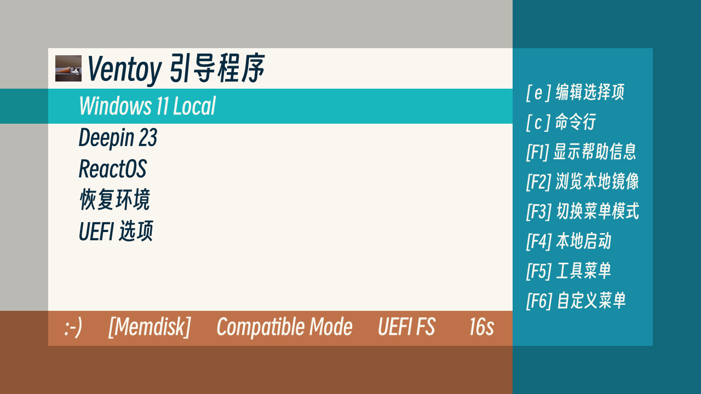

# 

> 🗃️[Github](https://github.com/PJ-568/568flat-ventoy-theme) | [Gitee](https://gitee.com/PJ-568/568flat-ventoy-theme) | [Pling](https://www.pling.com/p/2123244)

## 568flat

568flat is a cool grub 2 theme which is designed for ventoy.

> [568flat](#568flat-installation) is designed for resolution of 1024x544 and above.
>
> If your screen resolution is over 2048x1088, please use [568flat_x2](#568flat_x2-installation) for better experience.

## Installation

If the resolution is not over 2048x1088, please goto [568flat Installation](#568flat-installation); Else, goto [568flat_x2 Installation](#568flat_x2-installation).

Download the theme and extract it.

### 568flat Installation

Copy the `568flat` folder into `ventoy/themes` which should be located in the partition where your ISOs are located.

Make sure that `ventoy/ventoy.json` (at least) contains:

```json
{
    "theme":{
        "file":[
            "/ventoy/themes/568flat/theme.txt"
        ],
        "fonts":[
            "/ventoy/themes/568flat/SmileySans-Oblique_48.pf2",
            "/ventoy/themes/568flat/SmileySans-Oblique_32.pf2"
        ]
    }
}
```

### 568flat_x2 Installation

Copy the `568flat_x2` folder into `ventoy/themes` which should be located in the partition where your ISOs are located.

Make sure that `ventoy/ventoy.json` (at least) contains:

```json
{
    "theme":{
        "file":[
            "/ventoy/themes/568flat_x2/theme.txt"
        ],
        "fonts":[
            "/ventoy/themes/568flat_x2/SmileySans-Oblique_96.pf2",
            "/ventoy/themes/568flat_x2/SmileySans-Oblique_64.pf2"
        ]
    }
}
```

## Q&A

- Could not find some of the files or directories in my ventoy disk.
  - Please create one if missing.
- UI looks too small on my screen.
  - Lower the resolution of ventoy or use hi-res version of the theme, such as 568flat_x2 instead of 568flat.
- Did not see the display of \[Memdisk\] etc.
  - The statuses should show when you enable them. And it works with ventoy only.
- Does the theme supports grub?
  - In theory, yes. But it is not tested.
- Why using a picture instead of a label as title?
  - Some how, I could only make ventoy use the last font it loads by now. So a picture is used temporarily.

---

Please leave your comments and suggestions. Let me know if what is wrong or can be improved.

:-D

---

[About Smiley Sans](https://github.com/atelier-anchor/smiley-sans)

[More info about ventoy themes](https://www.ventoy.net/en/plugin_theme.html)
