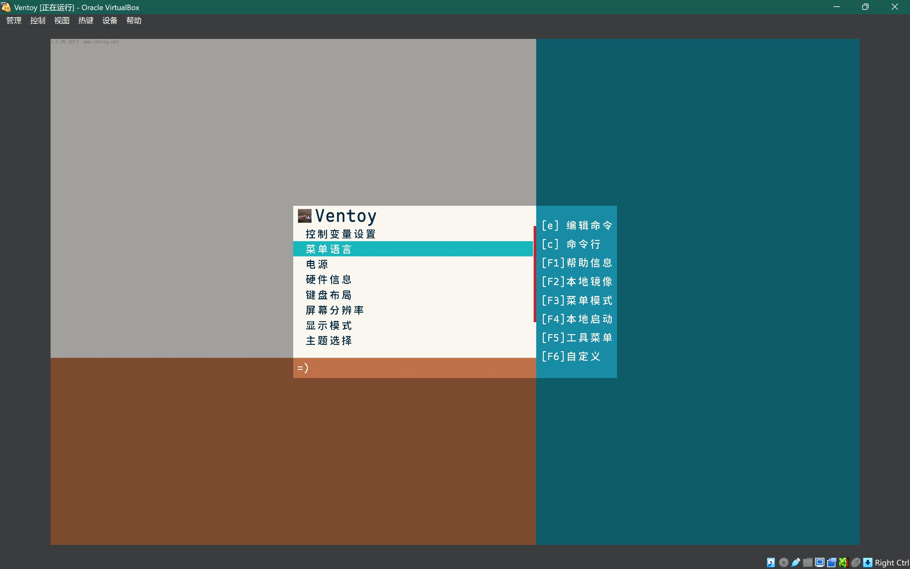
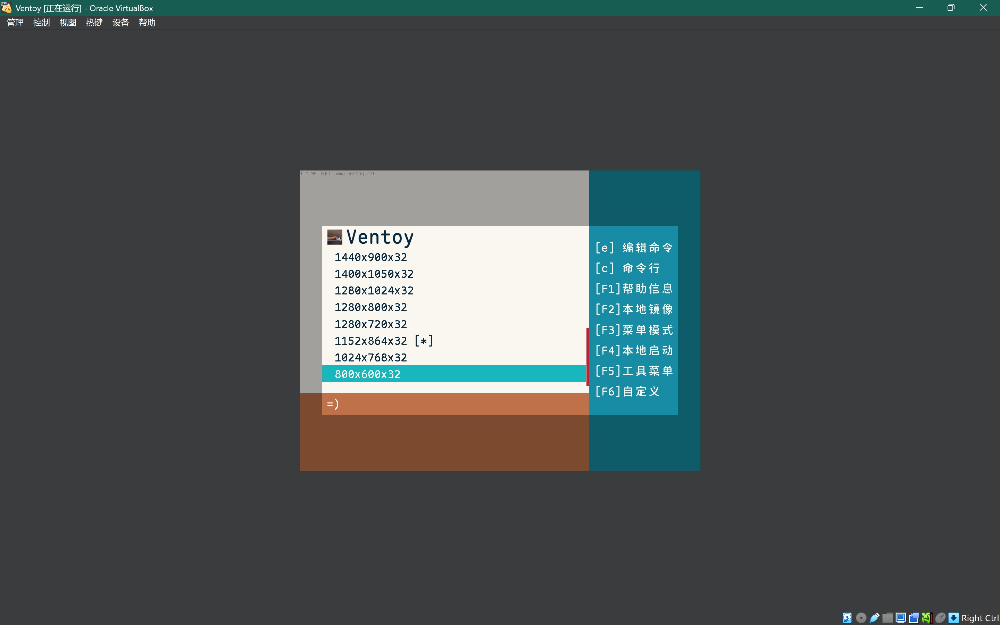
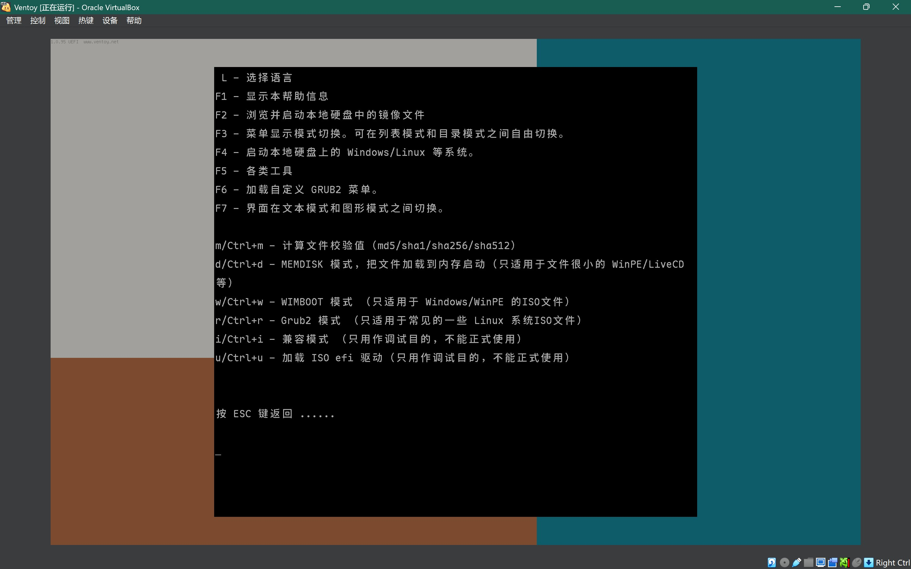
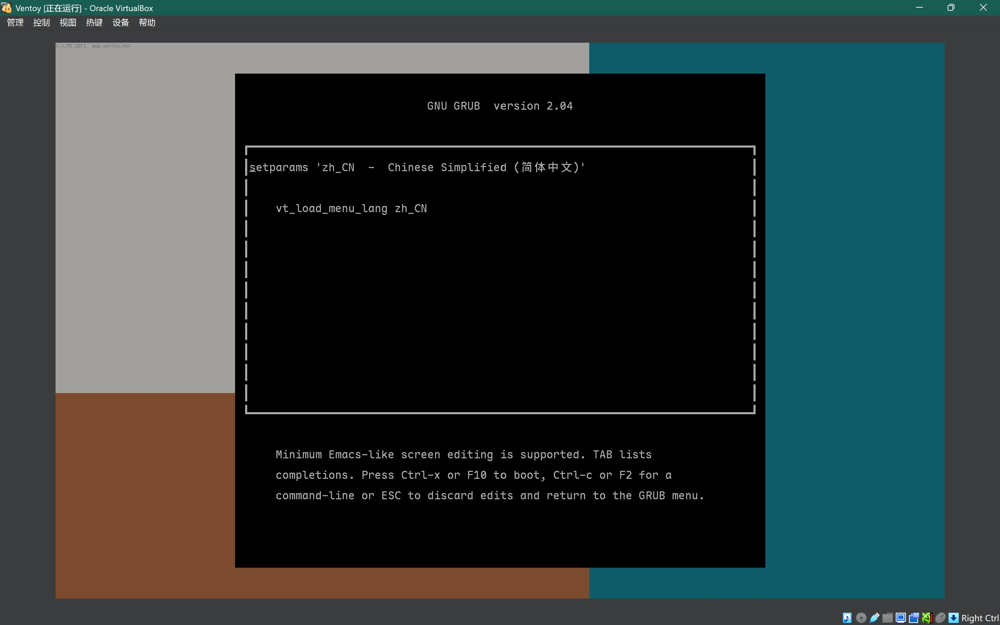

# 

> 🗃️[Github](https://github.com/PJ-568/568flat-ventoy-theme) | [Gitee](https://gitee.com/PJ-568/568flat-ventoy-theme) | [Pling](https://www.pling.com/p/2123244)

[English](README.md) | 简体中文

## 568flat主题

568flat是一个为Ventoy设计的酷炫GRUB 2主题。

> [568flat](#568flat安装)专为1024x544及以上分辨率设计。
>
> 如果您的屏幕分辨率超过2048x1088，请使用[568flat_x2](#568flat_x2安装)以获得更好的体验。

|||
|-|-|
|||

## 安装指南

如果分辨率不超过2048x1088，请跳转至[568flat安装](#568flat安装)；否则，请跳转至[568flat_x2安装](#568flat_x2安装)。

从[发布页面](https://github.com/PJ-568/568flat-ventoy-theme/releases)下载主题并解压。

### 568flat安装

将`568flat`文件夹（英文版为`568flat-en`文件夹）复制到存放ISO文件的分区中的`ventoy/themes`目录下。

确保`ventoy/ventoy.json`至少包含以下内容：

```json
{
    "theme":{
        "file":[
            "/ventoy/themes/568flat/theme.txt"
        ],
        "fonts":[
            "/ventoy/themes/568flat/MapleMono-CN-Medium_48.pf2",
            "/ventoy/themes/568flat/MapleMono-CN-Medium_32.pf2"
        ]
    }
}
```

英文版配置：

```json
{
    "theme":{
        "file":[
            "/ventoy/themes/568flat-en/theme.txt"
        ],
        "fonts":[
            "/ventoy/themes/568flat-en/MapleMono-CN-Medium_48.pf2",
            "/ventoy/themes/568flat-en/MapleMono-CN-Medium_32.pf2"
        ]
    }
}
```

### 568flat_x2安装

将`568flat_x2`文件夹（英文版为`568flat_x2-en`文件夹）复制到存放ISO文件的分区中的`ventoy/themes`目录下。

确保`ventoy/ventoy.json`至少包含以下内容：

```json
{
    "theme":{
        "file":[
            "/ventoy/themes/568flat_x2/theme.txt"
        ],
        "fonts":[
            "/ventoy/themes/568flat_x2/MapleMono-CN-Medium_96.pf2",
            "/ventoy/themes/568flat_x2/MapleMono-CN-Medium_64.pf2"
        ]
    }
}
```

英文版配置：

```json
{
    "theme":{
        "file":[
            "/ventoy/themes/568flat_x2-en/theme.txt"
        ],
        "fonts":[
            "/ventoy/themes/568flat_x2-en/MapleMono-CN-Medium_96.pf2",
            "/ventoy/themes/568flat_x2-en/MapleMono-CN-Medium_64.pf2"
        ]
    }
}
```

## 构建说明

```bash
chmod +x build.bash
bash build.bash
```

## 常见问题

- 在Ventoy磁盘中找不到某些文件或目录
  - 如果缺失请手动创建
- 界面在我的屏幕上显示过小
  - 降低Ventoy的分辨率或使用高分辨率版本的主题，例如使用568flat_x2而非568flat
- `[Memdisk]`或其他状态未显示
  - 当您启用这些状态时应该会显示，且仅适用于Ventoy
- 该主题支持GRUB吗？
  - 理论上支持，但未经测试
- 这是什么字体？
  - [Maple Mono](https://github.com/subframe7536/maple-font)字体
- 为什么使用图片而非文字作为标题？
  - 目前我只能让Ventoy使用最后加载的字体，因此暂时使用图片替代

---

欢迎留下您的意见和建议。如果有任何问题或改进建议，请告诉我。

:-D

---

[关于Maple Mono字体](https://github.com/subframe7536/maple-font)

[更多关于Ventoy主题的信息](https://www.ventoy.net/zh/plugin_theme.html)
